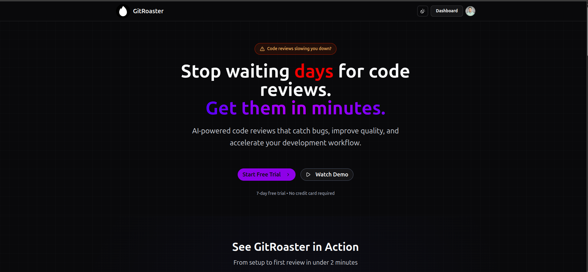
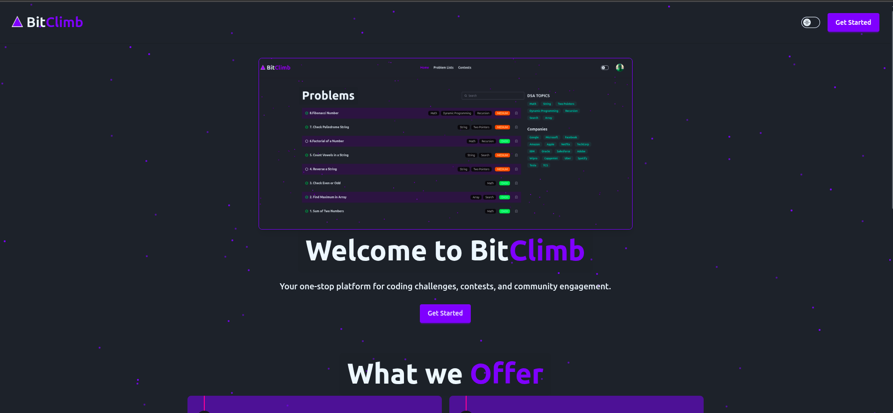

  
  

    
  

  <h1>
    Hi 👋, I'm Vineet Raj
  </h1>
  
  

    🚀 <strong>Full-Stack Builder</strong> • Crafting end-to-end solutions that solve real-world problems
  

  
  

    
    
    
    
  

 

  <table>
    <tr>
      <td align="center" width="96">
        
         React
      </td>
      <td align="center" width="96">
        
         Next.js
      </td>
      <td align="center" width="96">
        
         TypeScript
      </td>
      <td align="center" width="96">
        
         Node.js
      </td>
      <td align="center" width="96">
        
         Express
      </td>
    </tr>
    <tr>
      <td align="center" width="96">
        
         Docker
      </td>
      <td align="center" width="96">
        
         MongoDB
      </td>
      <td align="center" width="96">
        
         PostgreSQL
      </td>
      <td align="center" width="96">
        
         Git
      </td>
      <td align="center" width="96">
        
         Redis
      </td>
    </tr>
  </table>

 

---

  
  

  

 

---

## 🚀 Featured Projects

<table>
  <tr>
    <td width="50%">
      <h3 align="center">GitRoaster - AI Pull Request Reviewer</h3>
      

        
      

      
<em>A SaaS for automated pull request reviews, with team management, billing, and privacy-first architecture.</em>

      
<strong>Stack:</strong> Next.js, Node.js, Nginx, Docker, MongoDB

    </td>
    <td width="50%">
      <h3 align="center">BitClimb - Code Execution Platform</h3>
      

        
      

      
<em>Competitive programming platform with a custom execution engine to reduce runtimes by 50%.</em>

      
<strong>Stack:</strong> React, Express.js, Docker, Redis, PostgreSQL

    </td>
  </tr>
</table>

## 📝 Latest Tech Articles

<table>
<tr>
<td width="50%" align="center">
  
   
  <a href="https://blog.unknownbug.tech/introduction-to-oops" target="_blank"><strong>Introduction to OOPs</strong></a>
</td>
<td width="50%" align="center">
  
   
  <a href="https://blog.unknownbug.tech/linked-lists-in-data-structure-and-algorithms" target="_blank"><strong>Linked Lists in Data structure and Algorithms</strong></a>
</td>
  </tr>
<tr>
<td width="50%" align="center">
  
   
  <a href="https://blog.unknownbug.tech/arrays-in-data-structure-and-algorithms" target="_blank"><strong>Arrays in Data structure and Algorithms</strong></a>
</td>
<td width="50%" align="center">
  
   
  <a href="https://blog.unknownbug.tech/essential-docker-commands-every-beginner-should-learn" target="_blank"><strong>Essential Docker Commands Every Beginner Should Learn</strong></a>
</td>
  </tr>

</table>

  

---